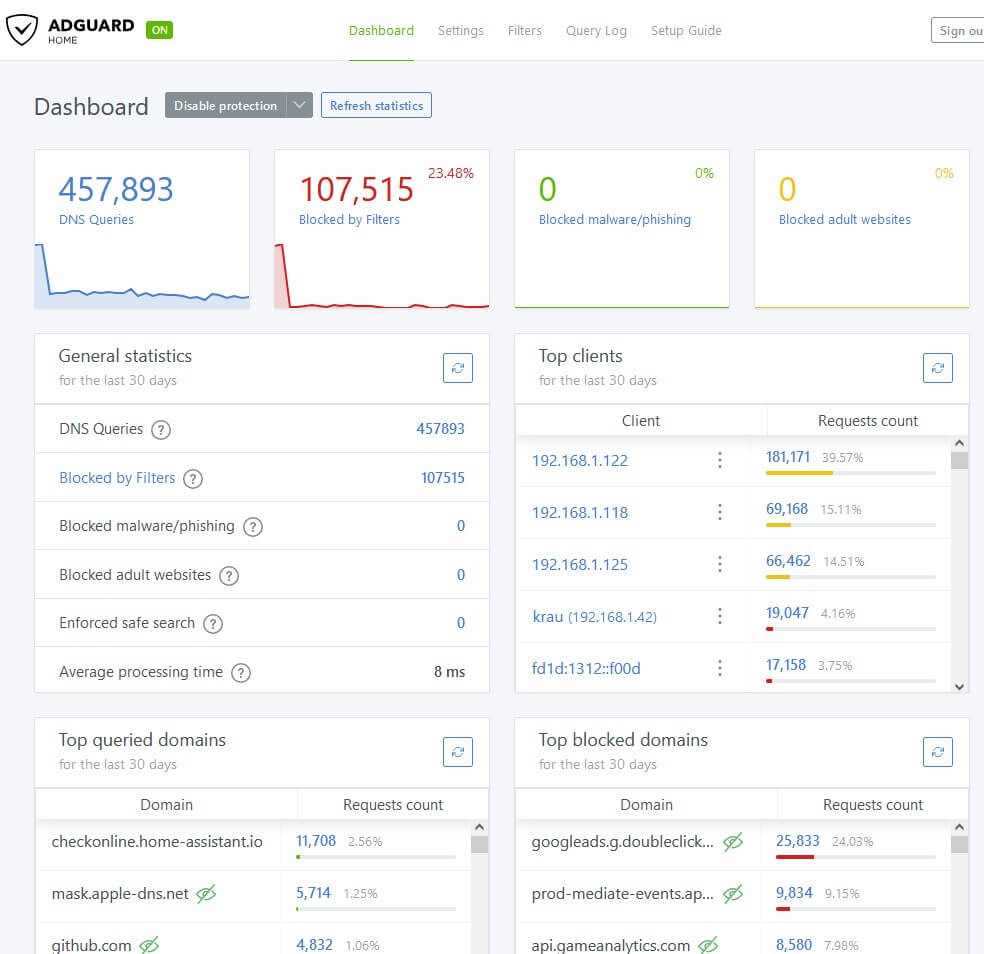

<!--
Важно: этот README был автоматически сгенерирован <https://github.com/YunoHost/apps/tree/master/tools/readme_generator>
Он НЕ ДОЛЖЕН редактироваться вручную.
-->

# AdGuard Home для YunoHost

[](https://ci-apps.yunohost.org/ci/apps/adguardhome/)


[](https://install-app.yunohost.org/?app=adguardhome)

*[Прочтите этот README на других языках.](./ALL_README.md)*

> *Этот пакет позволяет Вам установить AdGuard Home быстро и просто на YunoHost-сервер.*  
> *Если у Вас нет YunoHost, пожалуйста, посмотрите [инструкцию](https://yunohost.org/install), чтобы узнать, как установить его.*

## Обзор

AdGuard Home is a network-wide software for blocking ads & tracking. After you set it up, it'll cover ALL your home devices, and you don't need any client-side software for that.

It operates as a DNS server that re-routes tracking domains to a "black hole", thus preventing your devices from connecting to those servers. It's based on software we use for our public AdGuard DNS servers -- both share a lot of common code.

**Important note**: This AdGuard Home package needs to disable Dnsmasq on the main network interface to allow AdGuard Home to listen DNS resquest using it.  
However, Dnsmasq is not disabled and will continue to function as the *localhost DNS server*.


**Поставляемая версия:** 0.107.55~ynh1

## Снимки экрана



## Документация и ресурсы

- Официальный веб-сайт приложения: <https://adguard.com/adguard-home.html>
- Официальная документация пользователя: <https://kb.adguard.com/en>
- Официальная документация администратора: <https://github.com/AdguardTeam/AdGuardHome/wiki>
- Репозиторий кода главной ветки приложения: <https://github.com/AdguardTeam/AdGuardHome>
- Магазин YunoHost: <https://apps.yunohost.org/app/adguardhome>
- Сообщите об ошибке: <https://github.com/YunoHost-Apps/adguardhome_ynh/issues>

## Информация для разработчиков

Пришлите Ваш запрос на слияние в [ветку `testing`](https://github.com/YunoHost-Apps/adguardhome_ynh/tree/testing).

Чтобы попробовать ветку `testing`, пожалуйста, сделайте что-то вроде этого:

```bash
sudo yunohost app install https://github.com/YunoHost-Apps/adguardhome_ynh/tree/testing --debug
или
sudo yunohost app upgrade adguardhome -u https://github.com/YunoHost-Apps/adguardhome_ynh/tree/testing --debug
```

**Больше информации о пакетировании приложений:** <https://yunohost.org/packaging_apps>
