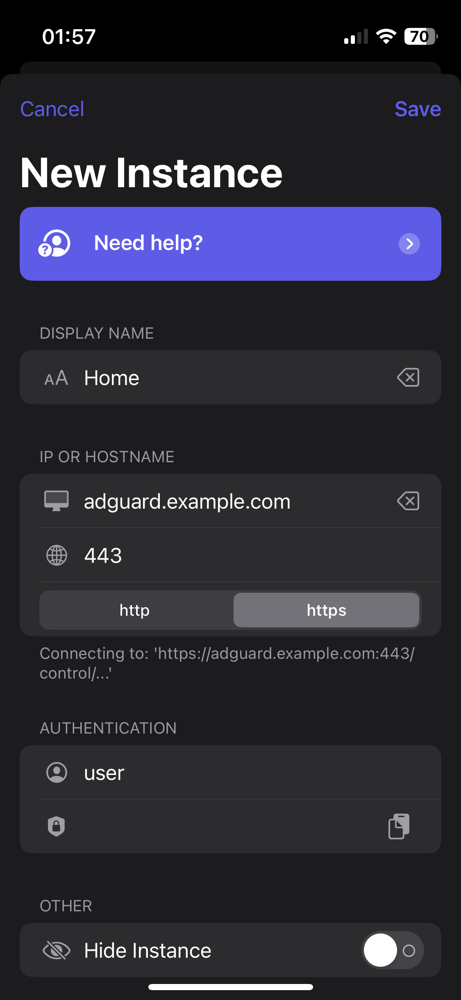

# Apps documentation

## Android

To be completed by someone who uses an Android app

## Apple devices

### AdGuard Home Remote

[AdGuard Home Remote](https://apps.apple.com/app/id1543143740) by [RocketScience IT](https://rocketscience-it.nl/) is compatible with Mac, iPhone, iPad and Watch.  
It is free with an in-app purchase of 6€ or US$5 to unlock some features. No ads, no tracking.

You can easilly configure it:

- Add Instance
- Choose a display name
- Write your AdGuard Home domain name, here `adguard.example.com` as an example
- Pick `https`, this will automatically fill the port field with `443`
- Enter your AdGuard Home credentials in the "Authentication" fields
- Test the connection, if a green check is showed up, you're alright

